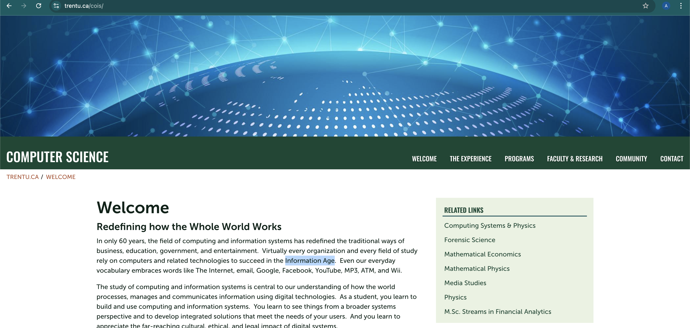

# Workshop 4

## Paragraphs

In only 60 years, the field of computing and information systems has redefined the traditional ways of business, education, government, and entertainment.  Virtually every organization and every field of study rely on computers and related technologies to succeed in the Information Age.  Even our everyday vocabulary embraces words like The Internet, email, Google, Facebook, YouTube, MP3, ATM, and Wii.

The study of computing and information systems is central to our understanding of how the world processes, manages and communicates information using digital technologies.  As a student, you learn to build and use computing and information systems.  You learn to see things from a broader systems perspective and to develop integrated solutions that meet the needs of your users.  And you learn to appreciate the far-reaching cultural, ethical, and legal impact of digital systems.

It is hard to imagine a world without computing and information systems.  It is even harder to imagine our world in another 60 years.  New software products and new technologies continue to change our landscape almost daily.  Even the products and technologies of other fields could not be developed without the support of computing and information systems.  It is arguably the most revolutionary field of our lifetime and we extend a warm welcome to be part of our adventure. 

## Strong and Emphasis

### Strong

In only 60 years, the field of **computing and information systems** has redefined the traditional ways of business, education, government, and entertainment.  Virtually every organization and every field of study rely on computers and related technologies to succeed in the __Information Age__.  Even our everyday vocabulary embraces words like The Internet, email, Google, Facebook, YouTube, MP3, ATM, and Wii.

### Emphasis

The study of _computing and information systems_ is central to our understanding of how the world processes, manages and communicates information using digital technologies.  As a student, you learn to build and use _computing and information systems_.  You learn to see things from a broader systems perspective and to develop integrated solutions that meet the needs of your users.  And you learn to appreciate the far-reaching cultural, ethical, and legal impact of digital systems.

It is hard to imagine a world without computing and information systems.  It is even harder to imagine our world in another 60 years.  New software products and new technologies continue to change our landscape almost daily.  Even the products and technologies of other fields could not be developed without the support of computing and information systems.  It is arguably the most revolutionary field of our lifetime and we extend a warm welcome to be part of our adventure. 

## Lists

### Ordered Lists

1. Item one
2. Item two
    1. Sub item one
    2. Sub item two
3. Item three

### Unordered lists

- Item one
- Item two
    - Sub item one
    - Sub item two
- Item three

## Images



## Hyperlinks

[Trent COIS Webpage](https://www.trentu.ca/cois/)

## Code

### In-line code

In HTML we use `` to display images

### Code fences

### HTML

```html
<nav>
    <ul>
        <li><a href="index.html">Home</a></li>
        <li><a href="grid.html">Grid</a></li>
        <li><a href="https://trentu.ca">Trent</a></li>
        <li><a href="https://loki.trentu.ca">Loki</a></li>
    </ul>
</nav>
```

### CSS

```css
header {
  display: flex;
  justify-content: space-between;
  align-items: center;
  padding: 0.5em;
  background-color: #a9c47f;
}
```